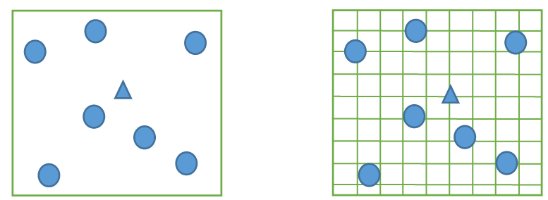
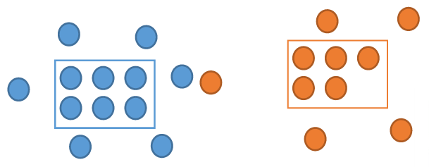

```{r setup, echo=FALSE, results='hide'}

options(stringsAsFactors=FALSE)
library(knitr)
library(zipcode)
suppressPackageStartupMessages(library(plyr))        # for munging data
suppressPackageStartupMessages(library(dplyr))  
suppressPackageStartupMessages(library(DEoptim)) # global optimization
suppressPackageStartupMessages(library(rCharts))
#suppressMessages(library(rMaps)) # interactive maps!
library(munsell)     # for colors

opts_chunk$set(echo=FALSE, results='hide', cache=TRUE)

```


Misnomer
--------

### Predictive Analytics World -- Government

Misnomer
--------

### ~~Predictive Analytics World -- Government~~

### Prescriptive Analytics Local -- Community

Themes
------

- 80/20 is **Cheap**
- Open Source, Modern Tools are **Powerful**
- ???

Problem
=======


- 4000+ members; 150-250 attendees
- **Where??**

Budget
------

- $0.00
- One half-decent data scientist (me)
- One solid operations researcher (Alan)
- A couple of weekends*
- One Macbook Air

<small>* since polished...</small>

Data
----

- survey of Meetup members
- ~150 respondents
- home and work ZIP codes

Some Data
---------

```{r load_data}
dat <- subset(read.csv('DC2_Survey_Locations.csv', colClasses='character'), select=c(Home_ZIP, Work_ZIP))
names(dat) <- tolower(names(dat))

dat <- mutate(dat,
              home_zip = sprintf("%05d", as.numeric(home_zip)),
              work_zip = sprintf("%05d", as.numeric(work_zip)))

data(zipcode)
home_zip <- zipcode
names(home_zip) <- paste0("home_", names(home_zip))
work_zip <- zipcode
names(work_zip) <- paste0("work_", names(work_zip))

dat <- left_join(dat, home_zip, by='home_zip')
dat <- left_join(dat, work_zip, by='work_zip')

white_house <- c(38.8977, -77.0366) # lat, long
dat <- subset(dat, (abs(home_latitude - white_house[[1]]) < 3.0 & 
             abs(home_longitude - white_house[[2]]) < 3.0) |
            (abs(work_latitude - white_house[[1]]) < 3.0 & 
             abs(work_longitude - white_house[[2]]) < 3.0))
dat <- subset(dat, !is.na(home_latitude))

dat <- tbl_df(dat)

```

```{r show_data1, results='asis'}
kable(dat[1:5,c(1,3:6)], format = "markdown")

```

Some Data
---------

```{r show_data2, results='asis'}
kable(dat[1:5,c(2,7:10)], format = "markdown")
```

Let's See That
--------------

```{r map_commutes, results='asis'}
mk_commuteline <- function(lat1, lon1, lat2, lon2) {
    if (is.na(lat2)) {
        list(type='Feature',
         geometry=list(type='LineString', coordinates=list(c(lon1, lat1), c(lon1, lat1))))
    } else {
        list(type='Feature',
         geometry=list(type='LineString', coordinates=list(c(lon1, lat1), c(lon2, lat2))))
    }
}

plot_with_linesegs <- function (lat1, lon1, lat2, lon2, center=white_house, fn=mk_commuteline) {
  map <- Leaflet$new()
  map$setView(center, zoom = 10)
  map$tileLayer(provider = 'Stamen.Toner')
  
  commute_lines <- lapply(seq_along(lat1), function(i) fn(lat1[[i]], lon1[[i]],
                                                         lat2[[i]], lon2[[i]]))
  #names(commute_lines) <- NULL # so converter creates a list
  map$geoJson(commute_lines, style=list(color="#ff5800", weight=5, opacity=0.65))
  
  map
}

with(dat, plot_with_linesegs(home_latitude, home_longitude, work_latitude, work_longitude))

```

How'd He Do That?!
------------------

R logo

- `rmarkdown` -- alternate text and code in one document
- `ioslides` -- HTML5 slide shows
- `rCharts` -- create web-based charts in R
- `Leaflet` -- Javascript map using OpenStreetMap

Goal
----

- Find a spot on the map
- (or maybe more than one)
- that makes all those orange lines happy

Location Optimization
=====================

Simple Example
--------------

```{r mapfns}
tbl2circlemap <- function (tt, center=c(mean(min(tt$latitude),max(tt$latitude)),
                                        mean(min(tt$longitude),max(tt$longitude))), zm=9) {
  map <- Leaflet$new()
  map$setView(center, zoom = zm)
  map$tileLayer(provider = 'Stamen.Toner')
  map$geoJson(toGeoJSON(alply(tt, 1, identity)),
              onEachFeature = '#! function(feature, layer){
                 layer.bindPopup(feature.properties.popup)
                 } !#',
              pointToLayer =  "#! function(feature, latlng){
                 return L.circleMarker(latlng, {
                 radius: feature.properties.radius || 10,
                 fillColor: feature.properties.fillColor || 'red', 
                 color: feature.properties.color || 'red',
                 weight: 1,
                 fillOpacity: feature.properties.fillOpacity || 0.8
                 })
                 } !#")
  map
}

```

```{r dcbalt, results='asis', fig.height=4}

qq <- data.frame(address=c('White House', 'Baltimore'), 
                 latitude=c(38.8977, 39.2833), longitude=c(-77.0366, -76.6167), 
                 fillColor=c('green', 'blue'),
                 color = '#333', fillOpacity = 0.5, radius = 20)

tbl2circlemap(qq)

```

Alice works in DC; Bob works in Baltimore. 

Where should Alice and Bob live?

Simple Example
--------------

```{r dcbalt2, results='asis', fig.height=4}

qq <- data.frame(address=c('White House', 'Baltimore', 'Optimal'), 
                 latitude=c(38.8977, 39.2833, mean(c(38.8977,39.2833))), 
                 longitude=c(-77.0366, -76.6167, mean(c(-77.0366, -76.6167))), 
                 fillColor=c('green', 'blue', 'gold'),
                 color = '#333', fillOpacity = c(0.5, .5, .9), radius = c(20,20,15))

tbl2circlemap(qq)

```

Sure.

But What If?
------------

```{r dcbalt3, results='asis', fig.height=4}

qq <- data.frame(address=c('White House', 'Baltimore'), 
                 latitude=c(38.8977, 39.2833), longitude=c(-77.0366, -76.6167), 
                 fillColor=c('green', 'blue'),
                 color = '#333', fillOpacity = 0.5, radius = 20)

tbl2circlemap(qq)

```

Alice works in DC; Bob works in Baltimore, but has to make two round-trips per day. 

Where should Alice and Bob live?

But What If?
------------

```{r dcbalt4, results='asis', fig.height=3}

qq <- data.frame(address=c('White House', 'Baltimore', 'BAD', 'Good'), 
                 latitude=c(38.8977, 39.2833, mean(c(38.8977,39.2833,39.2833)), 39.2833), 
                 longitude=c(-77.0366, -76.6167, mean(c(-77.0366, -76.6167, -76.6167)), -76.6167), 
                 fillColor=c('green', 'blue', 'red', 'gold'),
                 color = '#333', fillOpacity = c(0.5, .5, .9, .9), radius = c(20,20,15,15))

tbl2circlemap(qq)

```

Jessup = $2/3 + 2/3 + 1/3 + 1/3 + 1/3 + 1/3 = 2~2/3$

Baltimore = $1 + 1 + 0 + 0 + 0 + 0 = 2$ 

Location Optimization
---------------------

<div class="columns-2">

- Fermat-Weber


- Continuous / Discrete



- Single / Multiple Location


- Capacitated / Uncapacitated



</div>


Location Optimization Applications
--------

- Employee location at UPS
- **IKEA (inventory costs)**
- Crab pots
- Video surveillance cameras
- **Gas stations vs. Electric charging stations**
- McDonald’s
- Data centers
- Bicycle sharing system (Capital Bikeshare)
- Mosquito abatement
- Sensor placement on robotics 

Back to Meetups
===============

Cost Functions
--------------

__How good is a particular venue/location?__

- Work Distance

$\vert x_{venue} - x_{work} \vert + \vert y_{venue} - y_{work} \vert$

- Commute Distance

$\min(\text{work distance}, \text{home distance}, \text{tangent distance})$

**Inkscape illustration here**

Cost Function R Code
--------------------

here


Mapping R Code (tangent)
--------------

here

change slide background?

Placing Venues on the Map
-------------------------

show how to compute costs of various peoples' work places, and map

We Want the Best!
================

(ignoring roads, rivers, subways, traffic...)

Optimization
------------

say something about Nelder-Mead?

Optimization in R
-----------------

code

Winner!
-------

map

But
===

Think of the Children...
------------------------

in Fairfax County

Three-Location Optimum
----------------------

Goal:

- Make everyone happy,
- at least some of the time,
- by rotating among several venues.

Mini-min cost formula:

$\min_{v \in 1,2,3} \min_{x_v,y_v} C(x_v, y_v, \text{commutes})$

(6 parameters)

Problem | Optimization
---------------------

One-location problem is __convex__

picture

Three-location problem isn't -- "OR" in cost formula is a discontinuity.

Solution | Global Optimization
-----------------------------

+ a.k.a. "Computing Power is Cheap"

+ Using `DEoptim` -- Directed Evolution

+ Handwavy-explanation
    - Have a __population__ of candidate solutions
    - Combine pairs, extrapolating in promising directions
    - Randomly combine other pairs
    - Evaluate the cost function, taking the best
    - Repeat until done (bored)

Best Three Meetup Locations
---------------------------

map!

Thank You
=========

links to slides

Meetup tonight

contact info
