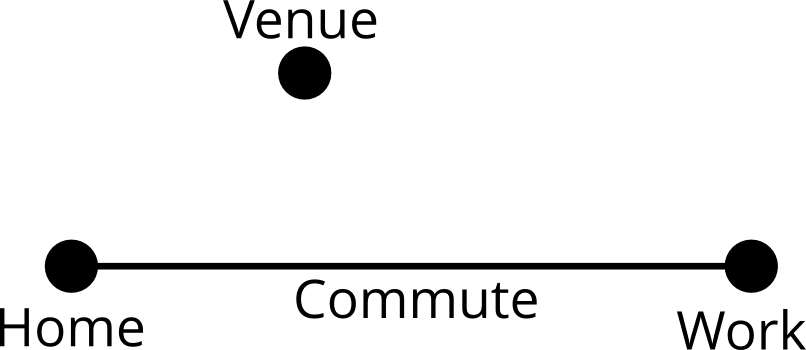
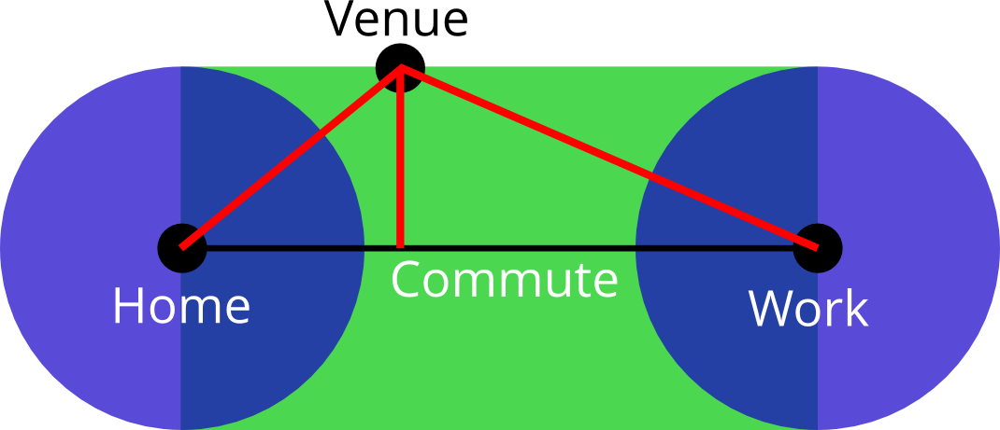

```{r setup, echo=FALSE, results='hide'}

options(stringsAsFactors=FALSE)
library(knitr)
library(zipcode)
suppressPackageStartupMessages(library(plyr))        # for munging data
suppressPackageStartupMessages(library(dplyr))  
suppressPackageStartupMessages(library(DEoptim)) # global optimization
suppressPackageStartupMessages(library(rCharts))
#suppressMessages(library(rMaps)) # interactive maps!
library(munsell)     # for colors

opts_chunk$set(echo=FALSE, results='hide', cache=TRUE)

```

Misnomer
--------

### Predictive Analytics World -- Government

Misnomer
--------

### ~~Predictive~~ Analytics World -- Government

### Prescriptive Analytics

Misnomer
--------

### ~~Predictive~~ Analytics ~~World~~ -- Government

### Prescriptive Analytics Local

Misnomer
--------

### ~~Predictive~~ Analytics ~~World~~ -- ~~Government~~

### Prescriptive Analytics Local -- Community

Themes
------

- 80/20 is **Cheap**
- Open Source, Modern Tools are **Powerful**
- **Optimization** is a key tool of Data Science (& Operations Research)

Problem
=======


> - Meetup.com -- grass-roots professional communities
> - 4000+ members; 150-250 attendees
> - Part of Data Community DC umbrella
> - **Where??**

Budget
------

- $0.00
- One half-decent data scientist (me)
- One solid operations researcher (Alan)
- A couple of weekends*
- One Macbook Air

<small>* since polished...</small>

Data
----

- survey of Meetup members
- ~150 respondents
- home and work ZIP codes

Some Data
---------

```{r load_data}
dat <- subset(read.csv('DC2_Survey_Locations.csv', colClasses='character'), select=c(Home_ZIP, Work_ZIP))
names(dat) <- tolower(names(dat))

dat <- mutate(dat,
              home_zip = sprintf("%05d", as.numeric(home_zip)),
              work_zip = sprintf("%05d", as.numeric(work_zip)))

data(zipcode)
home_zip <- zipcode
names(home_zip) <- paste0("home_", names(home_zip))
work_zip <- zipcode
names(work_zip) <- paste0("work_", names(work_zip))

dat <- left_join(dat, home_zip, by='home_zip')
dat <- left_join(dat, work_zip, by='work_zip')

white_house <- c(38.8977, -77.0366) # lat, long
dat <- subset(dat, (abs(home_latitude - white_house[[1]]) < 2.0 & 
             abs(home_longitude - white_house[[2]]) < 2.0) |
            (abs(work_latitude - white_house[[1]]) < 2.0 & 
             abs(work_longitude - white_house[[2]]) < 2.0))
dat <- subset(dat, !is.na(home_latitude))

dat <- tbl_df(dat)

```

```{r show_data1, results='asis'}
kable(dat[1:5,c(1,3:6)], format = "markdown")

```

Some Data
---------

```{r show_data2, results='asis'}
kable(dat[1:5,c(2,7:10)], format = "markdown")
```

Let's See That
--------------

```{r map_commutes, results='asis'}
mk_commuteline <- function(lat1, lon1, lat2, lon2) {
    if (is.na(lat2)) {
        list(type='Feature',
         geometry=list(type='LineString', coordinates=list(c(lon1, lat1), c(lon1, lat1))))
    } else {
        list(type='Feature',
         geometry=list(type='LineString', coordinates=list(c(lon1, lat1), c(lon2, lat2))))
    }
}

plot_with_linesegs <- function (lat1, lon1, lat2, lon2, center=white_house, fn=mk_commuteline) {
  map <- Leaflet$new()
  map$setView(center, zoom = 10)
  map$tileLayer(provider = 'Stamen.Toner')
  
  commute_lines <- lapply(seq_along(lat1), function(i) fn(lat1[[i]], lon1[[i]],
                                                         lat2[[i]], lon2[[i]]))
  #names(commute_lines) <- NULL # so converter creates a list
  map$geoJson(commute_lines, style=list(color="#ff5800", weight=5, opacity=0.65))
  
  map
}

with(dat, plot_with_linesegs(home_latitude, home_longitude, work_latitude, work_longitude))

```

How'd He Do That?!
==================

How'd He Do That?!
------------------

R logo

- `rmarkdown` -- alternate text and code in one document
- `ioslides` -- HTML5 slide shows
- `rCharts` -- create web-based charts and maps in R
- `Leaflet` -- Javascript map library using OpenStreetMap

Task
----

- Find a spot on the map
- (or maybe more than one)
- that makes those orange lines happy

Location Optimization
=====================

Simple Example
--------------

```{r mapfns}
tbl2circlemap <- function (tt, center=c(mean(min(tt$latitude),max(tt$latitude)),
                                        mean(min(tt$longitude),max(tt$longitude))), zm=9) {
  map <- Leaflet$new()
  map$setView(center, zoom = zm)
  map$tileLayer(provider = 'Stamen.Toner')
  map$geoJson(toGeoJSON(alply(tt, 1, identity)),
              onEachFeature = '#! function(feature, layer){
                 layer.bindPopup(feature.properties.popup)
                 } !#',
              pointToLayer =  "#! function(feature, latlng){
                 return L.circleMarker(latlng, {
                 radius: feature.properties.radius || 10,
                 fillColor: feature.properties.fillColor || 'red', 
                 color: feature.properties.color || 'red',
                 weight: 1,
                 fillOpacity: feature.properties.fillOpacity || 0.8
                 })
                 } !#")
  map
}

```

```{r dcbalt, results='asis', fig.height=4}

qq <- data.frame(address=c('White House', 'Baltimore'), 
                 latitude=c(38.8977, 39.2833), longitude=c(-77.0366, -76.6167), 
                 fillColor=c('green', 'blue'),
                 color = '#333', fillOpacity = 0.5, radius = 20)

tbl2circlemap(qq)

```

Alice works in DC; Bob works in Baltimore. 

Where should Alice and Bob live?

Simple Example
--------------

```{r dcbalt2, results='asis', fig.height=4}

qq <- data.frame(address=c('White House', 'Baltimore', 'Optimal'), 
                 latitude=c(38.8977, 39.2833, mean(c(38.8977,39.2833))), 
                 longitude=c(-77.0366, -76.6167, mean(c(-77.0366, -76.6167))), 
                 fillColor=c('green', 'blue', 'gold'),
                 color = '#333', fillOpacity = c(0.5, .5, .9), radius = c(20,20,15))

tbl2circlemap(qq)

```

Sure.

But What If?
------------

```{r dcbalt3, results='asis', fig.height=4}

qq <- data.frame(address=c('White House', 'Baltimore'), 
                 latitude=c(38.8977, 39.2833), longitude=c(-77.0366, -76.6167), 
                 fillColor=c('green', 'blue'),
                 color = '#333', fillOpacity = 0.5, radius = 20)

tbl2circlemap(qq)

```

Alice works in DC; Bob works in Baltimore, but has to make two round-trips per day. 

Where should Alice and Bob live?

But What If?
------------

```{r dcbalt4, results='asis', fig.height=3}

qq <- data.frame(address=c('White House', 'Baltimore', 'BAD', 'Good'), 
                 latitude=c(38.8977, 39.2833, mean(c(38.8977,39.2833,39.2833)), 39.2833), 
                 longitude=c(-77.0366, -76.6167, mean(c(-77.0366, -76.6167, -76.6167)), -76.6167), 
                 fillColor=c('green', 'blue', 'red', 'gold'),
                 color = '#333', fillOpacity = c(0.5, .5, .9, .9), radius = c(20,20,15,15))

tbl2circlemap(qq)

```

Jessup = $2/3 + 2/3 + 1/3 + 1/3 + 1/3 + 1/3 = 2~2/3$

Baltimore = $1 + 1 + 0 + 0 + 0 + 0 = 2$ 

Location Optimization
---------------------

<div class="columns-2">

- Fermat-Weber


- Continuous / Discrete


- Single / Multiple Location


- Capacitated / Uncapacitated


</div>


Location Optimization Applications
--------

- Employee location at UPS
- **IKEA (inventory costs)**
- Crab pots
- Video surveillance cameras
- **Gas stations vs. Electric charging stations**
- McDonald’s franchises
- Data centers
- Bicycle sharing system (Capital Bikeshare)
- Mosquito abatement
- Sensor placement on robotics 

Back to Meetups!
===============

Cost Functions
--------------

__How good is a particular venue/location?__

- Work Distance

$\big\vert x_{venue} - x_{work} \big\vert + \big\vert y_{venue} - y_{work} \big\vert$

- Commute Distance

$\min(\text{work distance}, \text{home distance}, \text{tangent distance})$



Cost Functions
--------------

__How good is a particular venue/location?__

- Work Distance

$\big\vert x_{venue} - x_{work} \big\vert + \big\vert y_{venue} - y_{work} \big\vert$

- Commute Distance

$\min(\text{work distance}, \text{home distance}, \text{tangent distance})$



Cost Function R Code
--------------------

```{r costfn-private}
# p-norm computation. p = 2 is euclidean
dist <- function(a,b,c,d, p=2) {
    (abs(a-b)^p + abs(c-d)^p)^(1/p)
}

# wrapper function for convenience
p2ls_cost <- function(df, lon, lat) {
    sum(p2ls_cost_v(df, c("home_longitude", "home_latitude", "work_longitude", "work_latitude"), lon, lat))
}

```
<small>
```{r costfn-public, echo=TRUE}
# http://stackoverflow.com/questions/849211/shortest-distance-between-a-point-and-a-line-segment
p2ls_cost_v <- function(df, cols, lon, lat, km_per_degree=69.11) {
    # convert from lat/lon to flat coordinates, using the lat/lon ratio at the point in question
    param_x = lon * km_per_degree * cos(lat)
    param_y = lat * km_per_degree
    home_x = df[[cols[[1]]]] * km_per_degree * cos(lat); home_y = df[[cols[[2]]]] * km_per_degree
    work_x = df[[cols[[3]]]] * km_per_degree * cos(lat); work_y = df[[cols[[4]]]] * km_per_degree
    
    # get the home distances; used if there's no work distance
    home_dists <- dist(home_x, param_x, home_y, param_y)
    
    # then, get the distances to the line segment, which may be NA
    # length of the segment (squared)
    l2 <- (home_x - work_x)^2 + (home_y - work_y)^2
    # t is the position of closest point on segment, with endpoints 0 and 1
    t <- (param_x - home_x) * (work_x - home_x) + 
         (param_y - home_y) * (work_y - home_y)
    t <- t / l2
    proj_x <- home_x + t * (work_x - home_x)
    proj_y <- home_y + t * (work_y - home_y)
    seg_dists <- ifelse(t < 0, 
                        home_dists,
                        ifelse(t > 1,
                               dist(work_x, param_x, work_y, param_y),
                               dist(proj_x, param_x, proj_y, param_y)))

    ifelse(is.na(seg_dists), home_dists, seg_dists)
}

```
</small>

Mapping R Code (tangent)
--------------

<small>
```{r map_commutes2, echo=TRUE, eval=FALSE}
# slightly simplified
mk_commuteline <- function(lat1, lon1, lat2, lon2) {
    list(type='Feature',
         geometry=list(type='LineString', coordinates=list(c(lon1, lat1), c(lon2, lat2))))
}

plot_with_linesegs <- function (lat1, lon1, lat2, lon2, center=white_house, fn=mk_commuteline) {
  map <- Leaflet$new()
  map$setView(center, zoom = 10)
  map$tileLayer(provider = 'Stamen.Toner')
  
  commute_lines <- lapply(seq_along(lat1), function(i) fn(lat1[[i]], lon1[[i]],
                                                         lat2[[i]], lon2[[i]]))
  map$geoJson(commute_lines, style=list(color="#ff5800", weight=5, opacity=0.65))
  
  map
}

with(dat, plot_with_linesegs(home_latitude, home_longitude, work_latitude, work_longitude))
```
</small>

Placing Workplaces on the Map
-----------------------------

```{r work_costs, echo=TRUE}
work_locs <- unique(select(dat, work_longitude, work_latitude)) %>%
    filter(!is.na(work_longitude))
names(work_locs) <- c('lon', 'lat')

work_locs <- adply(work_locs, 1, 
              function(rr) data.frame(cost=p2ls_cost(dat, rr$lon, rr$lat)))
work_locs$goodness <- 1-(work_locs$cost / max(work_locs$cost))
```

Placing Workplaces on the Map
-----------------------------

```{r plotcircles}
mk_circle <- function(lat, lon, color) {
    list(type='Feature',
         properties=list(color='black', fillColor=mnsl(sprintf("5R %d/10", color), fix=TRUE)),
         geometry=list(type='Point', coordinates=c(lon, lat)))
}

plot_with_circles <- function(latloncost, center=white_house, zoomlevel=10) {
  map <- Leaflet$new()
  map$setView(center, zoom = zoomlevel)
  map$tileLayer(provider = 'Stamen.Toner')
  
  latloncost$cost_color <- if (length(unique(latloncost$cost)) == 1) {
      5
  } else {
      with(latloncost, round(9*((cost-min(cost))/(max(cost)-min(cost)))^(1/4)))
  }
  markers <- dlply(latloncost, 1, function(row) with(row, mk_circle(lat, lon, cost_color)))
  names(markers) <- NULL # so converter creates a list
  map$geoJson(markers,
      pointToLayer='#! function (feature, latlng) {
          return L.circleMarker(latlng, {
      radius: 10,
      color: feature.properties.color,
      fillColor: feature.properties.fillColor,
      weight: 1,
      opacity: 0,
      fillOpacity: 0.9
  });
      } !#')
     
  map

}
```

```{r plotwork, results='asis'}
plot_with_circles(work_locs, zoom=11)
```

We Want the Best!
================

(ignoring roads, rivers, subways, traffic...)

Optimization
------------


Nelder-Mead/Simplex Optimization

* gradient-free, heuristic nonlinear optimization
* not the state of the art, but good enough
* this problem is actually convex; could solve it much faster

Optimization in R 
-----------------
<!-- TODO: put this in a scrolling div with fixed height -->
```{r opt1, echo=TRUE, results='markup'}
p2ls_cost_opt <- function(params) {
    p2ls_cost(dat, params[[2]], params[[1]]) # lon then lat...
}

best_point <- optim(white_house, p2ls_cost_opt, control=list(trace=1))

```

Winner!
-------

```{r opt1_plot, results='asis'}
plot_with_circles(data.frame(lat=best_point$par[[1]], lon=best_point$par[[2]], cost=0),
                  zoom=14)

```

**1225 Connecticut Ave NW**

But
===

Think of the Children...|in Fairfax County...
------------------------

```{r opt1_plot_big, results='asis'}
with(dat, plot_with_linesegs(home_latitude, home_longitude, work_latitude, work_longitude))
```

Three-Location Optimum
----------------------

Goal:

> - Make everyone happy,
> - at least some of the time,
> - by rotating among several venues.

Three-Location Optimum
----------------------

Goal:

- Make everyone happy,
- at least some of the time,
- by rotating among several venues.

_Mini-min_ cost formula:

<!-- $\min_{v \in 1,2,3} \min_{x_v,y_v} C(x_v, y_v, \text{commutes})$ -->

$$ \operatorname{cost} = \sum_{\operatorname{person}} min_{\operatorname{loc}_i} d(\operatorname{loc}_i, \operatorname{commute}_{\operatorname{person}}) $$

(6 parameters vs. 2)

Problem | Optimization
---------------------


One-location problem is __convex__.

Three-location problem isn't -- discrete `min` in cost formula is a discontinuity.

Solution | Global Optimization
-----------------------------

<div class="columns-2">
> + a.k.a. "Computing Power is Cheap"

> + Using `DEoptim` -- Directed Evolution

> + Handwavy-explanation
    - Have a __population__ of candidate solutions
    - Combine pairs, extrapolating in promising directions
    - Randomly combine other pairs
    - Evaluate the cost function, taking the best
    - Repeat until done (bored)


</div>

<!-- http://www.klopfenstein.net/lorenz.aspx/genetic-algorithms -->

Best Three Meetup Locations
---------------------------

```{r threelocfns}
colnames <- c("home_longitude", "home_latitude",
          "work_longitude", "work_latitude")
p2lsN_cost <- function(dat, latlons) {
    # for each pair of latlons, calc p2ls_cost
    costs <- laply(1:(length(latlons)/2), 
                   function(i) p2ls_cost_v(dat, 
                                               colnames, 
                                               latlons[[i*2-1]], latlons[[i*2]]))
    sum(aaply(costs, 2, min))
}
#p2lsN_cost.o <- cmpfun(p2lsN_cost)
p2lsN_cost_opt <- function(latlons) {
    p2lsN_cost(dat, latlons)
}

```

```{r threeloc, cache=TRUE}
# constrain the points to be not too far from DC (Manassas to B'more, roughly)
lower_box <- rep(c(38.693408, -77.448911), 3)
upper_box <- rep(c(39.284748, -76.668881), 3)

three_loc_de <- DEoptim(p2lsN_cost_opt, lower=lower_box, upper=upper_box,
                     control=list(trace=TRUE, NP=150, itermax=100, c=.1, strategy=3))
```

```{r threelocmap, cache=TRUE, dependson='threeloc'}
plot_with_circles(data.frame(lat=three_loc_de$optim$bestmem[c(2,4,6)], 
                             lon=three_loc_de$optim$bestmem[c(1,3,5)], cost=0),
                  zoom=10)
```

> - 18th and I (not far from GWU)
> - Walter Reed
> - Montgomory Cty Fairgrounds

Concluding Thoughts
-------------------

* _You_ can do more than ever.
* _Community_ of people and tools.
* _Mix Things Up_.

Four Things
-----------

> * Slides are here: @@@

> * Come to Data Science DC! Tonight! 7pm! Lightning talks!

> * `harlan@datacommunitydc.org`  `@harlanh`

Thanks!
=======

